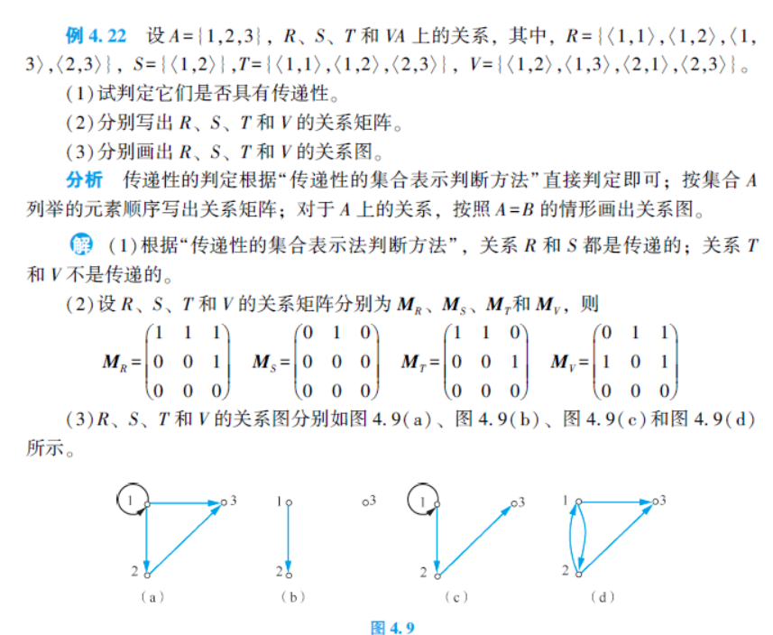
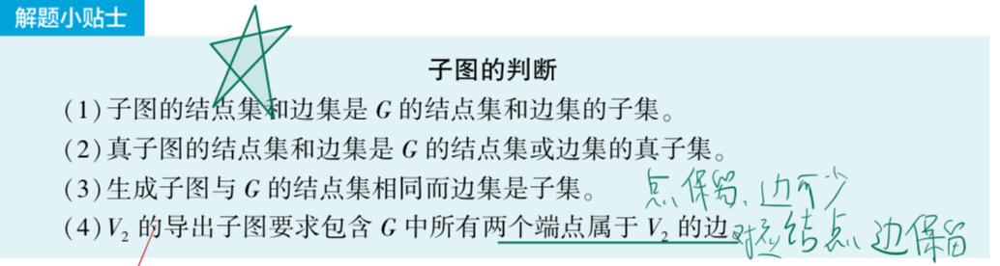

# 集合论

集合的基数：集合中元素个数

幂集（集族）：集合所有不同子集构成的集合

集合的对等（等势）：A、B之间存在一一对应关系

# 命题逻辑

命题：能判断真假的陈述句

原子命题&复合命题：不能再分解为更简单命题的命题称为原子命题；由命题联结词联结原子命题的叫复合changzhimingt命题。

命题常量/常值命题：原子命题。

命题变量/命题变元：P，Q，R等。

永真公式/重言式：任意给定解释下为真。

永假公式/矛盾式：同上。

命题的等价：对于所有出现在G,H命题变元的2^n组不同解释，真值都相同。

推理规则：

范式：公式的标准型。

联结词的完备集&极小联结词的完备集

文字&合取式（短语）&析取式（子句）&合取范式&析取范式

极大项&极小项  

# 谓词逻辑

个体词：原子命题中可以独立存在的客体（主，宾）

谓词：用于刻画客体性质或客体关系的部分·。

个体域/论域：个体变量的取值范围。

量词的辖域

原子谓词公式（原子公式）&合式谓词公式（……）:p(t1,t2,……)为原子公式；原子公式也是合式公式，注意递归定义。

自由变元&约束变元：辖域中变元自由/约束出现。

改名规则&供代入规则：改名和替换。

闭式：G是任意公式，且G中无自由变元。闭式在任何解释下都有确切真值。

谓词公式的解释有哪些构成：非空个体域D；每个常量符号；每个N元函数符号；每个N元谓词符号。

前束范式：量词、量词……+命题。

# 二元关系

序偶：由两个元素x,y按照一定次序组成的二元组，也称有序偶对。

笛卡尔积：A×B＝{<x，y>|(x∈A)∧(y∈B)}

二元关系： A，B 为两个非空集合，称 A×B 的任何子集 R 为从 A 到 B 的二元关系，简称关系（Relation），记作 R：A→B；A＝B，则称 R 为 A 上的二元关系，记作 R：A→A;若 $$\langle x, y\rangle \in R$$，则记为$$xRy$$，读作“x 对 y 有关系 R”.

空关系&全关系&恒等关系

复合关系、逆关系

自反&反自反&都不&都有（空集上的空关系）：

对称&反对称&都不&都有：

传递性：注意如果能连起来，组合后必须在；否则就不能有组合，如<2,3>也是{1，2，3，4}上的传递关系。

r、s、t：自反，对称，传递关系的闭包；都是添加元素后的集合。

   

# 特殊关系

相容关系：非空集合上，自反，对称（注意是相互包容，所以有对称性；同时自己与自己也是相容的，所以有自反性）

集合的覆盖：给定非空集合 A，设有集合$$S＝\{A(1),A(2),…,A(m)\}$$。 如果

- $$A_i\subseteq A$$且 $$A(i)≠ Ø,i=1,2,\cdots,m;$$
- $$\bigcup_{i=1}^{m}A_i=A$$

则 S 被称作集合 A 的一个覆盖。

划分：包含于A，不为空，相互之间无交集，并为A。

类/块：集合A由一个划分所分作的不同的类/块。

# 图论

图：序偶G=<v,e>

零图：仅由孤立节点组成的图

平凡图：仅含一个节点的零图。

多重图，线图和简单图：

​	平行边：有向图中，相同起点和终点的边；无向图中，两个节点间的边。

​	有平行边的叫多重图，无的叫线图，无环的线图叫简单图。

子图，真子图，导出子图和生成子图

结点度数：图G中以结点为端点的边数。

图的同构：设两个图$$G$$和$G'$，如果存在双射函数$$g:V→V$$，使得对于任意的$$e=(vi,vj) \in E$$当且仅当$$e'=(g(vi),g(vj)) \in E'$$，并且$e$与$$e$$的重数相同，则称$$G$$与$$G'$$同构（Isomor-phism），记为$$G\cong G'$$。

简单/基本（回）通路：基本点不同，简单边相异。

可达：两点之间存在通路。无向图中的可达关系也是一种等价关系。

无向图的连通性：若无向图 G 中的任何两个结点都是可达的，则称 G 是连通图，否则为非连通图（分离图）

有向图的连通性：

​		有向图 G 是**强连通图**的充分必要条件是 G 中存在一条经过所有结点的**回路**

​		有向图 G 是**单向连通图**的充分必要条件是 G 中存在一条经过所有结点的**通路**

# 特殊图

树：连通无回路的无向图，叫无向树，简称**树**。极大连通，极小无回。（平凡图也是树）

生成树：图G的某个生成子图是树，则称为G的生成树。生成树 $$T_G$$中的边称为**树枝**，G 中不在 $$T_G $$中的边称为**弦**， $$T_G $$的所有弦的集合称为生成树的**补**。

最小生成树：G中具有最小权的生成树。

有向树：若一个有向图去除所有方向得到的为树，该有向图为有向树。

一颗非平凡的**有向树**，如果恰有**一个结点的入度为 0**，其余所有**结点的入度均为 1**，则称之为**根树（外向树）**

- 入度为 0 的结点称为根；出度为 0 的结点称为叶；**入度为 1，出度大于 0 的结点称为内点**

- 内点和根统称为**分支点**

- 在根树中，从根到任一结点 v 的通路长度称为该结点的层数，所有结点的层数中最大的称为根树的**高**

  

K元树：T中每个分支点至多K个儿子

​		完全K元树：所有**分支点恰好**有K个儿子

​		满K元树：完全K元**且**每个叶子节点的层数均为树高。

​		有序K元树

​	

前缀码：A={$$b_1$$,$$b_2$$,……$$b_m$$,}是一个符号集合，对任意元素互相不为前缀，则A为前缀码。

欧拉图：若G无孤立结点，存在一条回路经过每条边一次且仅一次，则G为欧拉图。

桥（割边）：

哈密顿图：经过每个结点一次仅一次的回路叫哈密顿回路，有则为哈密顿图。

偶图：

完全偶图（完全二部图/二分图）：$$V_1$$和$$V_2$$中每个结点都有且仅有一条边相关联。

匹配·：

平面图·：G中任意两条边除公共结点外没有其他交叉点。

|                        | 无向图                                                       |                            有向图                            |
| ---------------------- | ------------------------------------------------------------ | :----------------------------------------------------------: |
| 欧拉通路               | 仅有 0 或 2 个奇度数节点**（充要条件）**                     | 一个结点入度比出度大 1，另一个结点出度比入度大 1，其余入度等于出度。**（充要条件）** |
| 欧拉图（欧拉回路）     | 度数均为偶数**（充要条件）**                                 |                 入度等于出度**（充要条件）**                 |
| 哈密顿通路             | 任意两个不相邻的结点$$\deg(u)+\deg(v)\ge n-1$$               |                                                              |
| 哈密顿图（哈密顿回路） | 任意两个不相邻的结点$$\deg(u)+\deg(v)\ge n$$                 |               转为无向图后包含生成子图$$K_n$$                |
| **非**哈密顿通路       | 找到$$V$$的某个非空子集$$V_1$$，使得$$p(G-V_1)>|V_1|+1$$     |                                                              |
| **非**哈密顿图         | 找到$$V$$的某个非空子集$$V_1$$，使得$$p(G-V_1)>|V_1$$        |                                                              |
| **非**哈密顿通路/图    | 强烈推荐：标 AB                                              |                                                              |
| 偶图                   | 所有回路长度均为偶数**（充要条件）**                         |                                                              |
| **非**平面图           | 存在一个能收缩为$$K_5$$或$$K_3,3$$的子图**（充要条件）**$$m>3n-6$$ 或 $$m>\frac{k}{k-2}(n-2),k$$为次数 |                                                              |

偶图和平面图默认都是无向图

