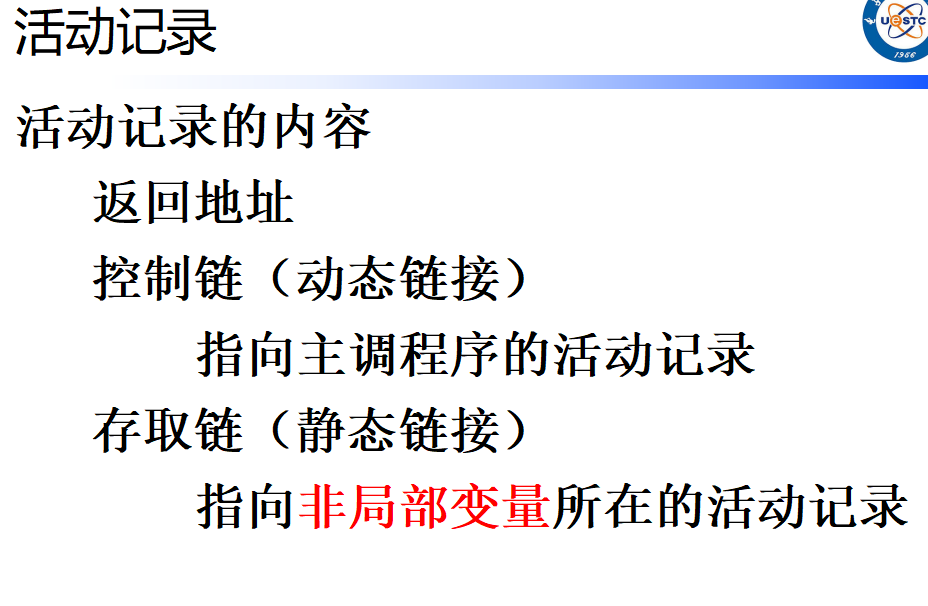
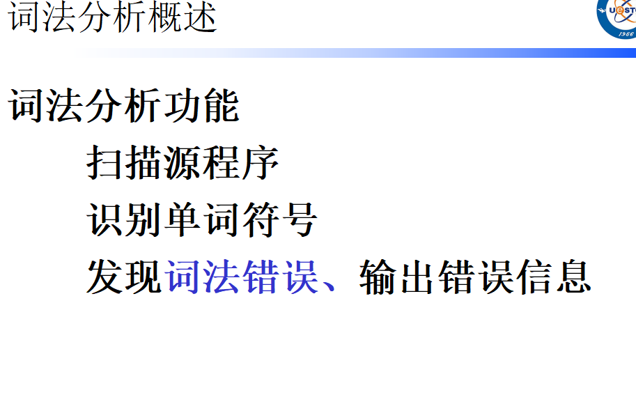
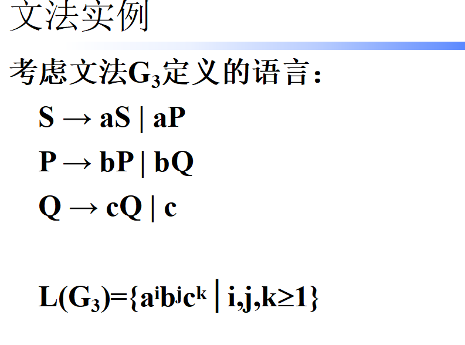
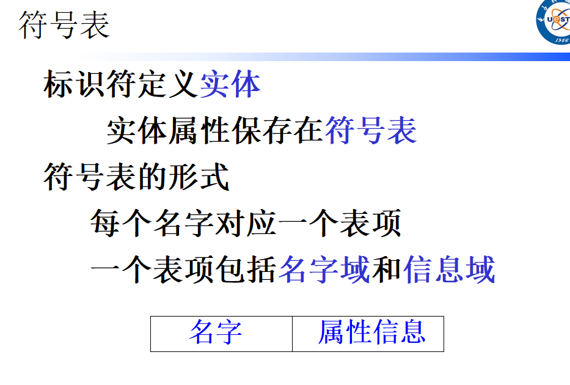
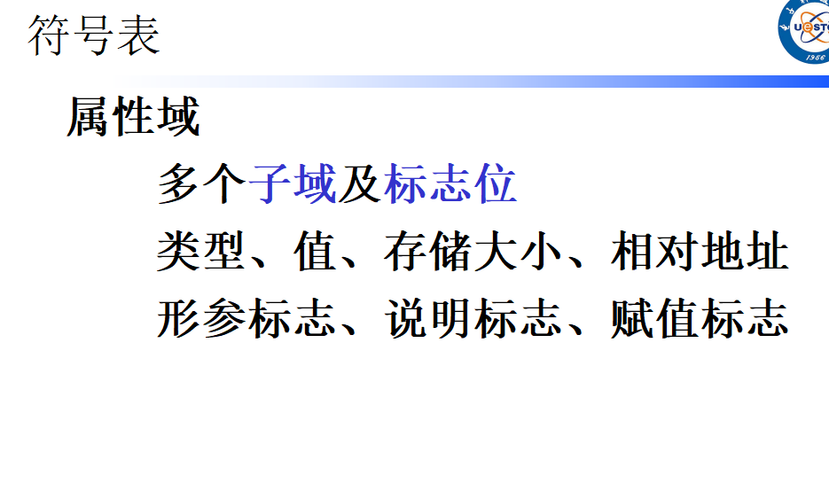

# 题型

共7-8大题，

第一道为问答题，5-6道小题，5分一道，

运行时环境+第一章，控制链、动态变量

> 静态链（Static Link）在活动记录中的作用主要是用来实现过程（函数）的嵌套调用和访问直接外层过程的数据。具体来说，静态链有以下几个作用：
>
> 1. **访问非局部数据**：静态链指向静态直接外层最新活动记录地址的指针，用来访问非局部变量，即那些定义在调用者作用域中的变量。
> 2. **实现过程嵌套调用**：在嵌套过程中，每个过程的活动记录（也称为栈帧）中，保存着该过程的直接外层过程的起始地址。静态链的作用是用来实现过程的嵌套调用。
> 3. **链接活动记录**：静态链在活动记录中保存了直接外层过程的起始地址，这样可以通过静态链将不同层次的活动记录链接起来，形成一个链表结构，方便程序在执行过程中进行上下文切换和数据访问。

# 章节重点

第二章：递归下降分析法

> 递归下降分析法是一种自顶向下的解析方法，主要用于解析上下文无关文法（Context-Free Grammars）。其核心思想是将文法的每个产生式规则直接转换为一个递归函数，通过这些函数的递归调用来尝试匹配输入字符串，从而实现对输入字符串的解析。以下是递归下降分析法的主要思想：
>
> 1. **对应产生式规则**：为文法中的每个非终结符创建一个递归函数。这些函数对应于文法的产生式规则。
> 2. **自顶向下解析**：解析过程从文法的起始符号开始，递归地尝试匹配输入字符串中的相应模式。
> 3. **递归调用**：当解析器遇到一个非终结符时，它会调用对应非终结符的函数。如果这个非终结符有多个产生式规则，解析器会尝试每一个规则，直到找到匹配的规则。
> 4. **回溯**：如果当前规则不匹配，解析器会回溯并尝试下一个规则。这种回溯机制允许解析器在遇到不匹配时重新选择其他可能的产生式规则。
> 5. **左递归处理**：递归下降分析法不能直接处理左递归，因为左递归会导致无限递归。因此，需要将文法转换为等价的非左递归形式。

第三章词法分析：词法分析作用、任务结合编译器概述

​				FLEX语法，BISON

​				正则表达式（描述->正则表达式，正则表达式->对应的串）

> 写出语言 L={a^(2m+1) b^(2m)} (m>=0)对应的正则表达式？
>
> 奇数个a，偶数个b：a(aa)* (bb)*

​				正则表达式转NFA

​				NFA->DFA

第四章语法分析：上下文无关文法概念

​				看懂以及理解**文法**

​				LL(1)以及其改造前提（消除左递归,提取公共因子）

​				LR系列的改造（拓广文法）

​				LR(0)、SLR(1)

​				句柄、语法树分析

第五章：语法制导的翻译了解就行

​				给定源程序，生成中间代码（PPT)

​				

**代码生成**：三地址代码（大题，简单考）；结合硬件生成汇编代码（较复杂，小概率）

中间**代码优化**：给定块代码（可能涉及循环）让你优化，**不直接考概念**

​							程序流图CFG，程序流图中DOM（支配）关系（在此基础上找出循环）

​							**变量活跃性**（可能结合**寄存器分配**）

# 此外

运行时环境：给定 ？），运行时相关问答题							

给定一个文法，问其生成串的特点，PPT上有示例

三地址代码结合中间代码生成

产生式、终结符、非终结符概念

符号表概念、设计(对应的数据结构：哈希、栈、红黑树等），第一大题

